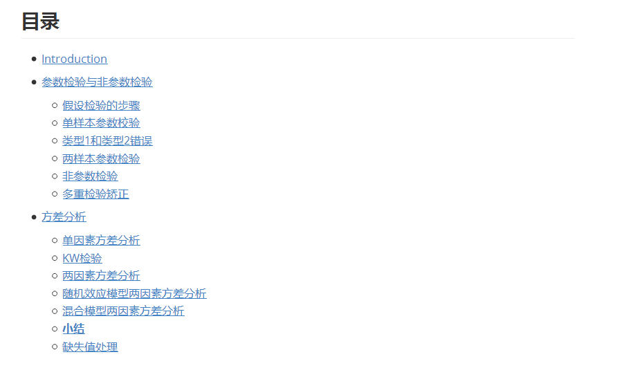
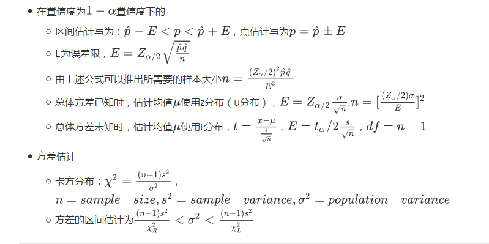

# Handbook_of_biostatistic_R
handbook of biostatistic and R

**作者： 王诗翔**

这个项目是对生物统计学以及相关R函数应用的整理和总结。

**想要获取良好的体验，请下载pdf或者html版本（需要将相应图片文件也下载，相对路径保持一致）。**

文本内容预览：

欢迎加入项目
===

**如果你对这个项目的内容和编辑感兴趣：**

知识离不开共享和编辑，欢迎进行补充和必要的修正！！
源文件用markdown编辑，为同路径下的[Handbook of Biostatistics and R.md](https://github.com/ShixiangWang/Handbook_of_biostatistic_R/blob/master/Handbook%20of%20Biostatistics%20and%20R.md)文件。文档中关于数学公式使用的是LeTex语法，所以有的编辑器可能（比如github）不支持。

**推荐使用[Typora](https://typora.io/)进行相应的文档编辑。**

